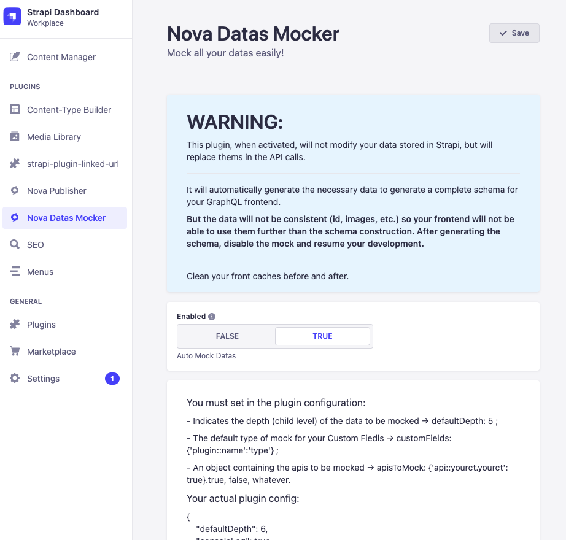

# Strapi plugin Nova Mock Datas

A quick description of `nova-datas-mocker` made by [NovaGaïa](https://novagaia.fr/).

This plugin aims to temporarily replace API responses with full mocks.

This Strapi plugin was originally made to answer one of my problems when I develop for **Gatsby**.
In order not to have GraphQL errors when fields/components/DynamicZone are not filled at all, it is necessary to create or force the creation of a Schema by Gatsby which identifies these fields. To do this, on the Gatsby side I use the plugin `gatsby-plugin-schema-snapshot`. But I have to fill at least 1 item for each Collection types with all the possibilities filled and the same for Single Types : it's tedious and generate errors, especially when we get snapshots from prod regularly.

That's why I created this plugin, so that it replaces, from time to time, the API responses by mocks that autogenerate with all the possibilities.

> I advise you to use `strapi-plugin-populate-deep` in parallel, so you don't have to declare all the populate=[*] on the Gatsby side. I was largely inspired by his plugin and I thank him for his work and for being an inspiration 🙏
> I was inspirad by this other plugin `strapi-plugin-transformer`, so I want to thank him to.

## WARNINGS

- **THIS PLUGIN IS AUTOMATICALLY DEACTIVATED IN PRODUCTION.**

## 1. Installation

### a. How to Install

Copy the following code and run from your terminal

```
npm i nova-datas-mocker
```

or

```
yarn nova-datas-mocker
```

### b. Configuration

#### I. plugins.js

The configuration is done in the plugin configuration.

```js
// ./config/plugins.js
// if change, run `npm run build --clean`
module.exports = ({ env }) => ({
  // ...
  'nova-datas-mocker': {
    enabled: true,
    config: {
      defaultDepth: 5, // default 5
      consoleLog: false, // default false
      customFields: { 'plugin::permalinks.permalink': `string` }, // default {}
      apisToMock: { 'api::page.page': true, 'api::global.global': true }, // default {}
    },
  },
  // ...
});
```

| Variable       | Description                                                                               | Type    | Default value |
| -------------- | ----------------------------------------------------------------------------------------- | ------- | ------------- |
| `defaultDepth` | Indicate the deep of the genration of Mocking datas                                       | Int     | 5             |
| `consoleLog`   | Enabled or not the verbous log                                                            | Boolean | false         |
| `customFields` | Object specifying which data type (Date, integer, Json, etc.) a CustomField should return | Object  | {}            |
| `apisToMock`   | Object containing a list of plugins that should not be managed by this plugin             | Object  | {}            |

`customFields` must return one of those data types :

- `string`
- `text`
- `richtext`
- `media`
- `json`
- `email`
- `password`
- `uid`
- `boolean`
- `float`
- `integer`
- `biginteger`
- `enumeration`
- `datetime`
- `date`
- `time`

> The data is mostly generated by `@faker-js/faker` or copied real data (Markdown and Media for example).

## 2. Usage

In the Strapi admin, you have a screen to enable/disable the mock functionality.


Open it in Plugin > Nova Datas Mocker

In the screen you have only a Toogle allowing to activate/deactivate the mock of the API datas.

**Please note**
As you modify the data returned by the API and the Strapi Admin uses these same APIs to display and modify the data, as long as the plugin is activated, you will have errors when displaying the Collection Types and the Single Types.
